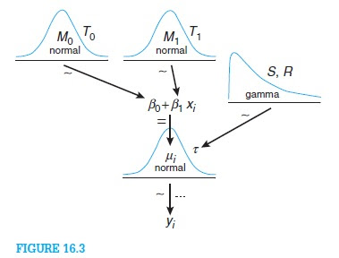
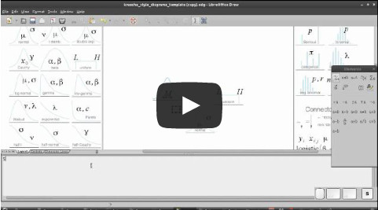

Diagrams of distributions in the style of Kruschke (2011)
=====================================================

The aim of the script `plot_dist.R` is to create diagrams of distribution to be used when illustrating Bayesian hierarchical models in the style of John K. Kruschke's [*Doing Bayesian Data Analysis*](http://www.indiana.edu/~kruschke/DoingBayesianDataAnalysis/). The image below shows an example taken from DBDA and Kruschke describes the advantages of this style of diagram compared to DoodleBUGS style diagrams in this [blog post](http://doingbayesiandataanalysis.blogspot.se/2012/05/graphical-model-diagrams-in-doing.html).



In order to create Kruschke style diagrams you need pretty pictures of the different distribution you have in your model, pictures that you later can stitch together in some drawing program (for example [Libre Office Draw](http://www.libreoffice.org/features/draw/) or [Inkscape](http://inkscape.org/)). The script `plot_dist.R` (written in [R](http://www.r-project.org/)) helps with this and to create a diagram of the normal distribution you would run the following code in your current R session.

```{r  fig.width=2.25, fig.height=1.688}
# Reads in the functions plot_dist, plot_dist_svg, plot_dist_png and a list of
# predefined distributions called dists.
source("plot_dist.R") 
plot_dist(dists$normal)
```
If you want to you can fill in the parameters yourself in the drawing program later but you can also make `plot_dist` draw the parameters by supplying a character or expression vector.

```{r  fig.width=2.25, fig.height=1.688, fig.show='hold'} 
plot_dist(dists$normal, labels=c(mean = expression(mu[j]), right_sd = expression(tau)))
plot_dist(dists$normal, labels=c(mean = expression(M[0]), right_sd = expression(T[0])))
plot_dist(dists$normal, labels=c(mean = expression(M[1]), right_sd = expression(T[1])))
plot_dist(dists$gamma, labels=c(params = "S, R"))
```

The image below shows the distributions that are currently implemented which covers the univariate distributions in [jags](http://mcmc-jags.sourceforge.net/) and some more. I am not overly familiar with all of these distributions and I was not sure what was the most "canonical" shape for some of them (the generalized gamma distribution for example). If you have any feedback, questions or suggestion (maybe on what distributions to add) please don't hesitate to contact me ([rasmus.baath@lucs.lu.se](rasmus.baath@lucs.lu.se))!


Files
------------------------

The file [plot_dist.R](plot_dist.R) contains all you need to get going: the functions `plot_dist`, `plot_dist_svg`, `plot_dist_png` and the list of the predefined distributions.

If you don't want to bother with generating your own images you can download png and svg images for all the distributions [here](distribution_diagrams.zip). The actual script that generated the images is available [here](create_diagrams.R) which might be useful to look at as it contains many examples of how `plot_dist` works.

I've also made a nifty template you can use together with the open-source [Libre Office Draw](http://www.libreoffice.org/features/draw/) that makes it really easy to make Kruschke style diagrams. Download the template [here](krusche_style_diagrams_template.odg). A file with some extra distributions for Libre Office Draw is available [here](extra_distributions.odg). I also made a short screencast that shows how to use this template:

[](http://youtu.be/uSJ2S900UHA)

Plot size and output format
---------------------------
The diagrams produced by `plot_dist` are made to look good when being around 2-3 inches wide and 1.5-2.5 inches high. If you want to make larger plots you have to play around with the scale parameter:

```{r fig.width=4, fig.height=3}
plot_dist(dists$beta, labels=c(params = "a, b"), scale=3)
```

However, if you just want to make `svg` or `png` files to import into a drawing program you can use the convenience functions `plot_dist_svg` and `plot_dist_png`.

```{r eval=FALSE}
plot_dist_png(dists$bernoulli, fname="bernoulli_dist.png", expression(theta))
plot_dist_svg(dists$bernoulli, fname="bernoulli_dist.svg", expression(theta))
```
As svg is a vector format you can then scale the diagrams to your liking in your drawing program.

Diagram customization
----------------

In order to know the label names of the different parameters you just look at the `labels` element of the corresponding distribution. For example:
```{r}
dists$t$labels
```

Here we see that the t distribution has five named labels and to make a diagram with a $\sigma$ to the left, and a `df` to the right we would write:

```{r  fig.width=2.25, fig.height=1.688, fig.show='hold'} 
plot_dist(dists$t, labels=c(mean = expression(mu), left_scale = expression(sigma), right_df = "df"))

```

You can also change the color of the diagrams using the parameter `color`.
```{r  fig.width=2.25, fig.height=1.688, fig.show='hold'} 
plot_dist(dists$bernoulli, labels=c(p = "p"), color="purple")

```

If you want to coustomize a diagram further you can create new distribution definitions. For examples of the current definitions look in the file `plot_dist.R`. The following is the definition of the normal distribution:

```{r eval=FALSE}
normal = list(
    # Name of the distribution to be displayed in the plot
    name = "normal",
    # Position of the name in the plot
    name_pos = c(0.5, 0.1),
    # Plot type, "line" for a line plots and "bar" for bar plots.
    plot_type = "line",
    # The values of the x-axis.
    x = seq(-3.3, 3.3, 0.01),
    # If top_space = 0 the distribution extends to the top of the graph, if 
    # 0 > top_space < 1 then that proportion of space is left at the top.
    top_space = 0,
    # The function defining the probability density function
    ddist = dnorm,
    # The arguments given to the probability density function (has to be named) 
    ddist_params = list(mean=0, sd=1),
    # Coordinates and names for the parameter labels
    labels = list(mean = c(0.5, 0.3), right_sd = c(0.80, 0.5), left_sd = c(0.20, 0.5))
  )
```

If we, e.g., wanted to make a folded normal distribution, we could take this denifintion and change it in the following way:
```{r fig.width=2.25, fig.height=1.688}
folded_normal <- dists$normal
folded_normal$name <- "folded norm."
folded_normal$name_pos <- c(0.35, 0.1)
folded_normal$x <- seq(0, 3.3, 0.1)
folded_normal$labels <- list(sd = c(0.55, 0.5))
plot_dist(folded_normal, "sd")

```
